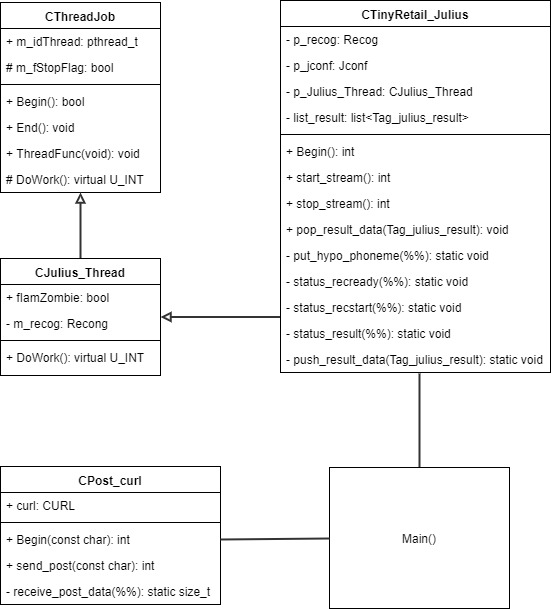

# TinyRetail-julius
- プロジェクト演習で用いる音声認識について、実装していきます。

## juliusの初期設定
### ライブラリーのインストール
```
$ sudo apt-get install alsa-utils sox libsox-fmt-all
```
- apt-getで失敗する場合、パッケージが古い可能性があるので最新にしておく
```
$ sudo apt-get update
$ sudo apt-get upgrade
$ sudo rpi-update
```
### USBマイクの確認
1. `$ lsusb` を実行します。
1. 接続されているデバイスの一覧が表示されるので、そこにUSBマイクがあることを確認する
  

### オーディオモジュールの優先順位の確認
1. `$ cat /proc/asound/modules` を実行し、モジュールの優先順位を確認する
```
$ cat /proc/asound/modules
 0 snd_bcm2835
 1 snd_usb_audio
```
2. USB入力を優先させる為に、`/etc/modprobe.d/alsa-base.conf`を下記のように書き換える   
※rasPiの場合、ファイルがない場合があるので作成すること
```
    options snd slots=snd_usb_audio,snd_bcm2835
    options snd_usb_audio index=0
    options snd_bcm2835 index=1
```
3. 一旦再起動する  
※変わらなければ、[ここ](http://qiita.com/fumisoro/items/a110ca2c0899fa63516a)を参考に

### マイクボリュームの調整
- マイクボリュームが小さいと声が拾えないので調整する
- ※しかし、高すぎるとノイズを拾いやすくなるので、丁度いい大きさを検証するとと
- Captureがマイクのボリュームです
```
$ amixer sset Mic 16 -c [カード番号(上の設定がうまく言ってれば "0")]
Simple mixer control 'Mic',0
  Capabilities: pvolume pvolume-joined cvolume cvolume-joined pswitch pswitch-joined cswitch cswitch-joined
  Playback channels: Mono
  Capture channels: Mono
  Limits: Playback 0 - 127 Capture 0 - 16
  Mono: Playback 16 [13%] [2.99dB] [off] Capture 16 [100%] [23.81dB] [on]
```   
#### カード番号の調べ方
- 今回の場合は、card=1, device=0
```
$ arecord -l
**** List of CAPTURE Hardware Devices ****
card 1: UAB80 [UAB-80], device 0: USB Audio [USB Audio]
  Subdevices: 1/1
  Subdevice #0: subdevice #0
```

### juliusのクローン
```
$ git clone https://github.com/KCG-ProjectEx/TinyRetail-julius.git
```

### postでサーバーにデータを転送するために、curlのインストール
```
sudo apt-get install curl libcurl3 libcurl3-dev
```

### うまく起動しない場合
1. 文字以下のようなエラーメッセージが出たら実行してみると良い  
`Stat: adin_oss: device name = /dev/dsp (application default)`  
`Error: adin_oss: failed to open /dev/dsp`
```
sudo sh -c "echo snd-pcm-oss >> /etc/modules"
```

## ソースの基本構造
  
### 各クラス詳細
1. **CThreadJob**  :  スレッドプログラムを実現する  
    スレッドを使うために必要な処理をまとめたクラスである。  
    - Begin() : 初期設定が行われる
    - End() : スレッドが終了する  
    - DoWork() : スレッド処理を行いたいプログラムをここに書く。  
    (※しかし、クラスを継承してDoWork()は別クラスに書くと良い)

1. **CJulius_Thread**  :  Juliuslibの一部分をCThreadJobを用いてスレッド化する  
    Juliuslibのストリーム(音声認識部)をスレッド化する  
    - DoWork() : 処理はCThreadJobを継承して、ここに書いている  
    - fIamZombie : "true"の時はスレッド終了待ち状態である。  

1. **CTinyRetail_Julius**  :  Juliuslibを用いたコントロールプログラム  
    Juliusのコアプログラムを操作するクラスである。  
    - Begin() : 音声入力やインプットファイル、マイクのテストなどの初期化を行う  
    - start_stream() : 音声認識をスタートさせる
    - stop_stream() : 音声認識を止める
    - pop_result_data() : 音声認識の結果データを取得する

1. **CPost_curl**  :  libcurlを使うクラス  
    Juliusの認証結果をpostを用いてwebサーバーに送信する
    - Begin() : 引数の送信先URLへのソケットを作成
    - send_post() : 引数でpostで送りたいデータを渡す
